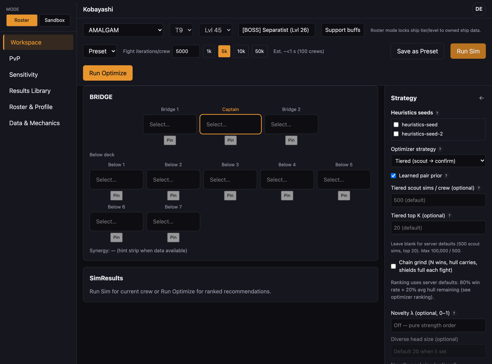

<div align="center">

# ⚔ KOBAYASHI

**Komprehensive Officer Battle Analysis: Your Assets Simulated against Hostiles Iteratively**

A high-performance Monte Carlo combat simulator and crew optimizer for [Star Trek Fleet Command](https://www.startrekfleetcommand.com/).

[](LICENSE)
[](https://www.rust-lang.org/)

*Because the only way to win the Kobayashi Maru is to change the conditions of the test.*

</div>

---

## Web UI Overview



The web interface has four pages: **Workspace** (ship, scenario, crew builder, Run Sim, Run Optimize), **Results Library** (saved optimization results), **Roster & Profile** (roster import, profile management), and **Data & Mechanics** (data exploration). The screenshot above shows the Workspace tab with a crew selected. Toggle Roster vs Sandbox mode to limit officers to your owned roster or use the full catalog. Run simulations or optimizations, save presets, and view results — all from your browser at `http://localhost:3000`.

---

## What is this?

STFC has **280+ officers** and growing. Each one has abilities that interact differently depending on slot, rank, synergies, and the hostile you're fighting. Factor in ship stats, research, buildings, reputation, artifacts, exocomps, and forbidden tech — and finding the optimal crew becomes a combinatorial nightmare.

**KOBAYASHI solves this through brute force.** It simulates thousands of fights per crew combination, tests every viable permutation, and ranks them by the metrics you care about: round-1 kill rate, win rate, hull remaining, fights before repair.

It runs locally on your machine, uses all your CPU cores, and gives you answers in seconds — not guesswork.

### Key Features

- **Monte Carlo combat simulation** — models crits, proc chances, shield mitigation, armor, ability timing, and more
- **Smart crew optimization** — exhaustive sweep and genetic algorithm for large search spaces; tiered simulation (scouting → confirmation) supported via `strategy: "tiered"`
- **LCARS officer definitions** — every officer ability is described in a declarative YAML-based language, no code changes needed to add new officers
- **Player profile support** — account for your research, buildings, reputation, and other non-officer bonuses
- **Synergy discovery** — manually tag known synergies, and let KOBAYASHI discover new ones from simulation data
- **Multithreaded** — embarrassingly parallel workload distributed across all CPU cores via Rayon
- **Local server + Web UI** — run the server from the project root, open browser. No Docker; frontend is built separately and served from disk

---

## Quick Start

### Build from source

```bash
git clone https://github.com/pggpgg/kobayashi-stfc
cd kobayashi-stfc
cargo build --release
```

On Windows, use `target\release\kobayashi.exe` instead of `./target/release/kobayashi`.

### Prebuilt releases (GitHub)

Tagged versions ([`.github/workflows/release.yml`](.github/workflows/release.yml)) publish **GitHub Release** assets: Linux x86_64 (`.tar.gz`), macOS Apple Silicon arm64 (`.tar.gz`), Windows x86_64 (`.zip`), plus a **`SHA256SUMS`** file for verification. Each archive contains the `kobayashi` binary, `frontend/dist/`, and a short `README.txt` (from [`packaging/RELEASE-BUNDLE-README.txt`](packaging/RELEASE-BUNDLE-README.txt)).

Unpack the archive **into a repository checkout at the same tag** so `./data/` and `./profiles/` already exist next to the binary and UI. Verify digests as described in [`docs/DEPLOYMENT_SECURITY.md`](docs/DEPLOYMENT_SECURITY.md).

Maintainers: push an annotated or GPG-signed version tag to trigger the workflow, for example `git tag -s v0.1.0 -m "Release v0.1.0"` then `git push origin v0.1.0`.

### Run

```bash
# Start the web interface
./target/release/kobayashi serve
# → Open http://localhost:3000

# Or use the CLI directly
./target/release/kobayashi optimize \
  --ship saladin \
  --hostile 2918121098 \
  --sims 5000

# Low-level combat sim (rounds, seed) — for ship/hostile/crew sims, use the Web UI
./target/release/kobayashi simulate 5 99 [--trace-events]
# Or with explicit attacker/defender stats:
./target/release/kobayashi simulate --attacker-attack 120 --attacker-pierce 0.15 \
  --defender-mitigation 0.35 --rounds 5 --seed 99
```

### Other commands

```bash
# Import roster from .txt (name,tier,level) or Spocks .json export
./target/release/kobayashi import <path> [--profile <id>]
# Bare filename resolves to profiles/<effective_profile>/<filename>

# Validate LCARS officer definitions (emits error/warning/info per mechanic)
./target/release/kobayashi validate data/officers

# Regenerate LCARS from canonical JSON
./target/release/kobayashi generate-lcars [path/to/officers.canonical.json] [--output data/officers]

# Use LCARS as officer source for simulation (default: canonical)
KOBAYASHI_OFFICER_SOURCE=lcars ./target/release/kobayashi optimize --ship saladin --hostile 2918121098 --sims 5000
```

### Data maintenance policy

**Discoverable tasks:** run `cargo xtask --help` from the repo root for ship/hostile/research refresh, `validate_data`, `generate_lcars`, `data:refresh`, and `npm run verify` wrappers (implementation: [`xtask/`](xtask/)).

**Refreshing combat/game data:** use the orchestrated importer chain — `cargo xtask data-refresh` or `npm run data:refresh` (optional flags `--stfcspace`, `--stfccommunity`, `--all`). See [scripts/README.md](scripts/README.md) for order and prerequisites.

**Research catalog (`data/research_catalog.json`):** GitHub Actions sets `CI=true`, so `cargo test` **must** find a non-empty catalog (the `scenario_research_integration` test fails with a short remediation message if it is missing). The committed file in the repo satisfies this. To regenerate after updating upstream research JSON under `data/upstream/data-stfc-space/research/`, run `node scripts/import_stfcspace_research.mjs --from-upstream --limit 0` (see [data/README.md](data/README.md) § Research). To match CI behavior locally, run with `KOBAYASHI_REQUIRE_RESEARCH_CATALOG=1`.

The project-maintained officer catalog (full officer list + tier progression) is updated manually by maintainers when the game adds officers. Separately, player-specific owned-roster data is intended to be importable for personalization (including imports sourced from Spocks.club exports). You can also sync your roster **quasi real-time** from the game using the [STFC Community Mod](https://github.com/netniV/stfc-mod); see [docs/SYNC.md](docs/SYNC.md) for setup.

For canonical officer data provenance, `officers.canonical.json` uses neutral metadata labels: each officer `source.workbook` value is set to `manual_curation` rather than storing a specific workbook filename.

---

## How It Works

### The Combat Engine

KOBAYASHI's core is a fast, deterministic combat simulator written in Rust. Each fight simulation takes under 1 microsecond. The engine models:

- Round-by-round attack resolution
- Shield mitigation and pierce mechanics
- Shield → hull overflow on shield break
- Armor damage reduction
- Critical hit chance and damage
- Extra attack procs (e.g., Nero's double shot)
- Decaying and accumulating buffs (e.g., Harrison's first-strike damage)
- On-kill triggers (e.g., Mudd's hull repair)
- Player profile bonuses applied as a pre-combat modifier layer

**Python reference (`tools/combat_engine`):** A small Python package mirrors core mitigation, pierce-through, apex, and isolytic math for experiments and CI checks against the Rust implementation. See [tools/combat_engine/README.md](tools/combat_engine/README.md). Run `python -m pytest tools/combat_engine/tests/ -v` (also executed via `npm run verify` and the `combat_engine_python` CI job).

### The Optimizer

Given a ship and a hostile, the optimizer searches the crew space. **Current implementation:** full exhaustive sweep — it runs the full candidate set with the requested sim count per crew and ranks results. For large search spaces, use `strategy: "genetic"` in the API to run the genetic optimizer instead. You can also select a **tiered approach** (scouting pass → confirmation on top candidates) via `strategy: "tiered"` (requires the optimizer's registry/candidate context).

*Tiered strategy (implemented via two-pass scouting → confirmation):*

| Phase | Sims per crew | What it does |
|---|---|---|
| **Scouting** | 100–500 | Tests all synergy combos + a sample of others. Keeps top 5%. |
| **Confirmation** | 5,000–50,000 | Full statistical analysis on surviving crews. Final ranking. |
| **Deep Dive (planned)** | 100,000+ | Optional. Per-round damage distributions, sensitivity analysis. |

Synergy-tagged crews are tested first, so even if you cancel early, you likely have the best results already.

**Scaling estimate** (280 officers, 3 crew slots, 16-core machine):

| Scenario | Time |
|---|---|
| Full exhaustive sweep (current) | ~3 minutes |
| Phase 1 scouting only (tiered strategy) | ~8 seconds |
| Phase 1 + Phase 2 (tiered strategy) | ~16 seconds |

### LCARS — The Officer Description Language

**Language for Combat Ability Resolution & Simulation**

Every officer is defined in a declarative YAML file. No code changes needed to add or update officers. The community can contribute definitions via pull requests.

```yaml
officers:
  - id: khan
    name: "Khan Noonien Singh"
    faction: augment
    rarity: epic
    group: "Botany Bay"

    captain_ability:
      name: "Superior Intellect"
      effects:
        - type: stat_modify
          stat: shield_pierce
          target: self
          operator: add
          value: 0.30
          trigger: passive
          duration: permanent
          scaling:
            base: 0.20
            per_rank: 0.025
            max_rank: 5
```

LCARS supports stat modifiers, extra attacks, tags, decay/accumulate effects, conditional triggers, and composable conditions. See [docs/DESIGN.md](docs/DESIGN.md#3-lcars-language-specification) for the full spec.

**Graceful degradation**: unknown effect types are logged and skipped — never crashed on. Officers can be defined before the engine fully supports all their mechanics.

**Effect overlap:** yes — multiple effects can be active in the same round. The simulator evaluates every active timing window (`combat_begin`, `round_start`, `attack`, `defense`, `round_end`) and applies compatible effects together. Morale, Hull Breach, and Burning are tracked independently, so they can overlap within the same round when triggered.

### Synergy System

KOBAYASHI treats synergies as a first-class concept:

- **Manual synergies** — tag known combos like Khan + Marcus (shield pierce stacking) or Khan + Nero (alpha strike burst)
- **Learned synergies** — after optimization runs, KOBAYASHI analyzes which officer pairs appear in top results more often than chance predicts, building a co-occurrence matrix that guides future searches
- **Group bonuses** — Botany Bay, Borg, and other officer groups with set bonuses

### Player Profile

Your effective combat stats depend on research, buildings, reputation, artifacts, and more. KOBAYASHI supports two modes:

- **Quick mode** (recommended): enter your total effective bonuses from all non-officer sources
- **Advanced mode** (future): itemize each source individually

```yaml
player_profile:
  name: "MyAccount"
  effective_bonuses:
    weapon_damage: 1.45    # +145% total from research, buildings, etc.
    shield_hp: 1.30
    hull_hp: 1.55
    crit_chance: 0.08
```

---

## Project Structure

Project documentation (design, roadmap, sync, performance, combat plans) lives in the [`docs/`](docs/) directory.

```
kobayashi/
├── src/
│   ├── main.rs              # CLI entry point
│   ├── data/                # Data models (officers, ships, hostiles, profiles)
│   ├── lcars/               # LCARS parser, schema validator, ability resolver
│   ├── combat/              # Combat engine (the hot loop), PRNG, buff system
│   ├── optimizer/           # Monte Carlo, tiered sim, genetic algo, ranking
│   ├── parallel/            # Rayon thread pool, batch distribution, progress
│   └── server/              # Axum HTTP server; REST + SSE (optimize job stream); no WebSocket
├── data/
│   ├── officers/            # LCARS officer definitions (.lcars.yaml), canonical JSON, registries
│   ├── ships_extended/      # Ship combat stats (index + per-id JSON, tiers/levels)
│   ├── hostiles/            # Hostile index + per-id JSON
│   ├── buildings/           # Building index + per-building JSON
│   ├── registry.json        # Top-level data registry (and related JSON under data/)
│   └── heuristics/          # Optional optimizer seed lists (.txt)
├── profiles/                # Per-player sync + imports (see profiles/README.md); roster CSV sources can live next to each profile (e.g. profiles/default/my_roster.txt)
├── frontend/                # Web UI (React); build with npm, served from frontend/dist
└── tests/                   # Combat validation, LCARS parsing, optimizer regression
```

### Architecture (actual)

The server uses **Tokio + Axum 0.7**: an async multi-threaded runtime with an Axum router in `src/server/routes.rs`. CPU-bound work (optimize, simulate) is offloaded via `tokio::task::spawn_blocking`, keeping the runtime responsive to concurrent requests. The API is **REST-first**, with **Server-Sent Events** for long-running optimize job progress (`GET /api/optimize/jobs/:job_id/stream`); there is **no WebSocket** support. The **frontend is not embedded** in the binary: the SPA is built with `npm run build` in `frontend/` and served from the filesystem (`frontend/dist`) when the server is run from the project root. Run the server from the project root so it can find `frontend/dist` and `data/`.

**Ops:** `GET /api/health` returns JSON with `build` (crate version, optional `git_sha_short` when built from git), `server` (`started_at_utc`, effective `max_concurrent_cpu_jobs`, whether `KOBAYASHI_MAX_CONCURRENT_CPU_JOBS` was set, `cpu_job_permits_available` / `cpu_job_permits_total`, optional bounded-queue settings `cpu_job_queue_wait_ms` and `cpu_job_queue_wait_ms_from_env` for `KOBAYASHI_CPU_JOB_QUEUE_WAIT_MS`), and `data` (officer count, ship/hostile index `data_version` strings when present, load flags). When `KOBAYASHI_CPU_JOB_QUEUE_WAIT_MS` is a positive value at server start and all CPU slots are busy, those routes return **503** with `code: cpu_busy` and a `Retry-After` header instead of waiting forever (restart to apply changes). Raising `KOBAYASHI_MAX_CONCURRENT_CPU_JOBS` above 1 increases parallel CPU work; tune `KOBAYASHI_RAYON_THREADS` so the process does not oversubscribe cores.

The UI is served from the same origin as the API by default. For custom deployments (e.g. API behind a reverse proxy), set **`VITE_API_BASE`** at build time so API requests use that base URL: `VITE_API_BASE=/api npm run build` in `frontend/`.

**Security:** `X-Profile-Id` / `?profile=` select a profile but are not authentication. For LAN/internet exposure, read [docs/DEPLOYMENT_SECURITY.md](docs/DEPLOYMENT_SECURITY.md) (optional `KOBAYASHI_API_KEY`, loopback trust, sync tokens).

**Profiles:** Only the bundled `profiles/demo/` sample is meant for public sharing; your `index.json` (tokens, names, other profile dirs) stays local—see [profiles/README.md](profiles/README.md). A fresh clone gets a generated index on first server start.

---

## Contributing

For CI, pre-commit hooks, branch protection, and a one-shot script that mirrors the main CI jobs, see [CONTRIBUTING.md](CONTRIBUTING.md).

### Adding or updating officers

Officer definitions live in `data/officers/officers.lcars.yaml`. LCARS is the source of truth for combat abilities; the canonical JSON can be regenerated from LCARS if needed.

To add or update officers:

1. Edit `data/officers/officers.lcars.yaml`
2. Follow the [LCARS schema](docs/DESIGN.md#3-lcars-language-specification)
3. Run `kobayashi validate data/officers` to validate LCARS files (or `kobayashi validate data/officers/officers.canonical.json` for canonical JSON)
4. Submit a PR

To regenerate **`data/officers/officers.lcars.yaml`** from `officers.canonical.json` (maintainer-curated catalog; see repo data policy), optionally sync ids and below-decks slots from cached stfc.space officer JSON, then generate:

```bash
python3 scripts/normalize_officer_id_strings.py   # optional; needs data/upstream/.../officers/*.json
kobayashi generate-lcars [path/to/officers.canonical.json] [--output data/officers] \
  [--summary data/upstream/data-stfc-space/summary-officer.json] \
  [--translations data/upstream/data-stfc-space/translations-officer_buffs.json]
```

`generate_lcars` writes a **single** `officers.lcars.yaml` under `--output`. By default it loads `summary-officer.json` and `translations-officer_buffs.json` (when present) and fills **`captain_ability` / `bridge_ability` / `below_decks_ability` `name:`** from `officer_ability_name` rows (`loca_id` ↔ `ability_id`). Use `--no-ability-names` for legacy placeholder names like `{Officer} (Captain)`.

See [docs/LCARS_CONTRIBUTING.md](docs/LCARS_CONTRIBUTING.md) and [docs/OFFICER_TRANSLATIONS_MAPPING.md](docs/OFFICER_TRANSLATIONS_MAPPING.md) for the modifier mapping and translation join model.

### Validating against real fights

The combat engine needs calibration against real in-game results. If you can record fight outcomes (damage dealt per round, rounds to kill, etc.) and submit them as test fixtures in `tests/fixtures/recorded_fights/`, that's incredibly valuable.

### Reporting issues

If the optimizer's ranking doesn't match your in-game experience, open an issue with your crew, ship, hostile, and player profile. This helps us identify combat formula inaccuracies.

---

## Roadmap

- [x] Combat engine with deterministic PRNG
- [x] LCARS schema and parser
- [x] Monte Carlo simulation runner
- [x] CLI interface
- [x] LCARS ability resolver (YAML → BuffSet)
- [x] Tiered optimization (scouting → confirmation)
- [x] Crew generator (exhaustive + filtered)
- [x] Parallel batch execution
- [x] Web UI on localhost (MVP)
- [x] User-owned roster import workflow (CLI + Web UI, Spocks.club export)
- [ ] Synergy learning from simulation results (planned)
- [x] Genetic algorithm optimizer (implemented)
- [x] Chain grinding simulation (N sequential fights: hull carry-over, full shields each link; optimizer + API + UI)
- [ ] Armada mode (multi-ship combat) (planned)
- [ ] Sensitivity analysis ("what if I promote this officer?") (planned)
- [x] Full 280+ officer LCARS database

---

## Acknowledgments

- Inspired by [tu_optimize](https://github.com/zachanassian/tu_optimize), the Monte Carlo deck optimizer for Tyrant Unleashed
- The STFC community for reverse-engineering combat formulas
- The name references the [Kobayashi Maru](https://memory-alpha.fandom.com/wiki/Kobayashi_Maru_scenario) — because the only way to win is to change the conditions of the test

---

## License

[MIT](LICENSE) — do whatever you want with it.

---

<div align="center">

*⚔ Live long and optimize.*

</div>
