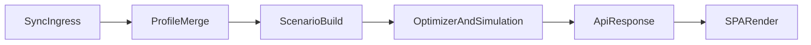

# KOBAYASHI

**Komprehensive Officer Battle Analysis: Your Assets Simulated against Hostiles Iteratively**

A high-performance Monte Carlo combat simulator and crew optimizer for Star Trek Fleet Command. Locally run, multithreaded, with a web interface on localhost. Inspired by [tu_optimize](https://github.com/zachanassian/tu_optimize) for Tyrant Unleashed.

Officers are described using **LCARS** (Language for Combat Ability Resolution & Simulation), a declarative DSL that allows any officer ability to be defined without code changes.

---

## Table of Contents

1. [Project Overview](#1-project-overview)
2. [Architecture](#2-architecture)
3. [LCARS Language Specification](#3-lcars-language-specification)
4. [Combat Engine](#4-combat-engine) (includes [4.6 Effect ownership & defender crews](#46-effect-ownership-combatcontext-and-defender-side-crews))
5. [Player Profile & Bonus Layer](#5-player-profile--bonus-layer)
6. [Optimizer Strategies](#6-optimizer-strategies)
7. [Synergy System](#7-synergy-system)
8. [Parallelism & Performance](#8-parallelism--performance)
9. [Data Maintenance & User Roster Import](#9-data-maintenance--user-roster-import)
10. [Frontend & UI](#10-frontend--ui)
11. [Project Structure](#11-project-structure)
12. [Dependencies](#12-dependencies)
13. [Open Questions & Future Work](#13-open-questions--future-work)

---

## 1. Project Overview

### Problem

STFC has ~280 officers (and growing), each with abilities that vary by slot (captain, bridge, below decks), rank, and level. Combat effectiveness depends on the interaction between officers, ship stats, player research, buildings, reputation, artifacts, exocomps, forbidden tech, alliance research, favors, and more. The combinatorial space is enormous and players currently rely on community guides and intuition to pick crews.

### Solution

KOBAYASHI simulates thousands of fights using Monte Carlo methods, testing crew combinations against specific hostiles and ranking them by configurable metrics (round-1 kill rate, win rate, hull remaining, etc.). It uses smart search strategies (synergy prioritization, tiered simulation, genetic algorithms) to handle the massive search space efficiently.

### Design Principles

- **Local server + Web UI**: Rust backend using **Tokio + Axum** (`src/server/`). CPU-heavy handlers offload work with `tokio::task::spawn_blocking` and share a process-wide **semaphore** (`KOBAYASHI_MAX_CONCURRENT_CPU_JOBS`) so many concurrent requests do not oversubscribe the machine; optional bounded queue wait returns HTTP 503 when saturated (`KOBAYASHI_CPU_JOB_QUEUE_WAIT_MS`). The frontend is built separately (Node/npm) and served from disk (`frontend/dist`) when the server is run from the project root (via `tower-http` static serving and SPA fallback). No Docker; run from project root so the server finds `frontend/dist` and `data/`.
- **Community-driven data**: Officers defined in LCARS (YAML), hostiles and ships in JSON. Community contributes definitions via pull requests. Schema validation catches errors automatically.
- **Graceful degradation**: Unknown ability types are logged and skipped, not crashed on. Accuracy improves incrementally as more mechanics are supported.
- **Performance-first**: The combat engine is the hot loop. Zero allocations, no dynamic dispatch, pre-computed buffs. Target: 2–5M simulations/sec/core.

---

## 2. Architecture

**Actual stack:** Tokio + Axum 0.7 (`src/server/mod.rs` + `routes.rs`). Multi-threaded async runtime; CPU-bound work (optimize, simulate) offloaded via `tokio::task::spawn_blocking` and gated by a shared **Tokio semaphore** (`cpu_admission`, env `KOBAYASHI_MAX_CONCURRENT_CPU_JOBS`). The API is **REST-first**; there is **no WebSocket**. Long-running optimize jobs can be tracked with **JSON polling** (`GET /api/optimize/status/:job_id`) or **Server-Sent Events** (`GET /api/optimize/jobs/:job_id/stream`). Optional `KOBAYASHI_CPU_JOB_QUEUE_WAIT_MS` bounds how long a handler waits for a CPU slot; when exceeded, the server responds with **503** and `code: cpu_busy` (plus `Retry-After`). Frontend is served from the filesystem (`frontend/dist`) when present, not embedded in the binary.

```
┌─────────────────────────────────────────────────────┐
│                    FRONTEND                         │
│  React on localhost:3000 (served from frontend/dist)│
│  ┌─────────┐ ┌──────────┐ ┌───────────┐            │
│  │  Crew   │ │   Sim    │ │  Synergy  │            │
│  │ Builder │ │ Results  │ │   Graph   │            │
│  └────┬────┘ └────┬─────┘ └─────┬─────┘            │
│       └───────────┼─────────────┘                   │
│    REST + SSE (optimize job stream); no WebSocket   │
├─────────────────────────────────────────────────────┤
│                  RUST BACKEND                       │
│                                                     │
│  ┌──────────────────┐  ┌───────────┐  ┌──────────┐ │
│  │ Axum HTTP Server │  │ Optimizer │  │  Combat  │ │
│  │ (Tokio async)    │──│  Layer    │──│  Engine  │ │
│  └──────────────────┘  └───────────┘  └──────────┘ │
│           │                    │             │      │
│  ┌────────┴────────┐  ┌────────┴───┐  ┌─────┴────┐ │
│  │ Roster / Static │  │  Synergy   │  │  LCARS   │ │
│  │ (frontend/dist) │  │  Index     │  │  Parser  │ │
│  └─────────────────┘  └───────────┘  └──────────┘ │
│                              │                      │
│  ┌───────────────────────────┴──────────────┐      │
│  │  Data Layer: officers, ships, hostiles,  │      │
│  │  profiles (filesystem, run from root)     │      │
│  └──────────────────────────────────────────┘      │
│                                                     │
│  ┌──────────────────────────────────────────┐      │
│  │  Rayon Thread Pool (work-stealing)       │      │
│  │  Each thread: own PRNG, lock-free output │      │
│  └──────────────────────────────────────────┘      │
└─────────────────────────────────────────────────────┘
```

### 2.1 Contributor data flow

This is the onboarding-level flow from synced game data to rendered UI output:



- **Sync ingress:** data enters through the sync endpoints in `src/server/sync.rs`.
- **Profile merge:** synced roster and profile bonuses are merged from profile files under `profiles/{id}/`.
- **Scenario build:** optimizer requests construct attacker/defender scenarios before simulation (`src/optimizer/monte_carlo/scenario.rs`).
- **Optimizer and simulation:** candidate crews are evaluated through optimizer strategies and the combat engine (`src/optimizer/` + `src/combat/`).
- **SPA render:** Axum API responses are consumed by the frontend workspace components under `frontend/src/`.

---

## 3. LCARS Language Specification

### 3.1 Overview

LCARS is a YAML-based DSL for describing officer abilities declaratively. Each officer has up to three ability sets (captain, bridge, below_decks), each containing one or more effects. Effects are composed from a vocabulary of primitives.

**File naming:** Use extension `.lcars.yaml` (or `.lcars.yml`). When loading a directory (e.g. `data/officers`), only files whose names match `*.lcars.yaml` or `*.lcars.yml` are loaded; other YAML files in the same directory are ignored so that config or other data is not parsed as officers.

### 3.2 Primitives

#### Stats (anything the combat engine tracks)

Combat stats: `weapon_damage`, `shield_hp`, `shield_mitigation`, `hull_hp`, `armor`, `crit_chance`, `crit_damage`, `dodge_chance`, `armor_pierce`, `shield_pierce`, `accuracy`, `damage_reduction`, `isolytic_damage`, `isolytic_defense`, `apex_shred`, `apex_barrier`, `shield_regen`

Non-combat stats: `repair_speed`, `warp_speed`, `cargo_capacity`, `mining_rate`

**Burning** is not modeled as a scalable combat stat (no known officer/research that turns 1% into 2%, etc.). While burning is active on the target, the engine applies a fixed fraction of the target’s **maximum** hull per round; when inactive, that tick is zero. Combat traces may still label the resulting hull loss with the key `burning_damage` for readability—that is event telemetry, not an officer `stat_modify` target.

The stat list is extensible. The engine ignores stats it doesn't recognize (with a warning).

#### Supported mechanics matrix

The simulator tracks implementation status per combat mechanic. LCARS validation maps each effect/condition to this matrix so users can see whether a ranking is exact or partial.


| Mechanic        | LCARS cues (effects/conditions/stats)                                                                                                                                         | Status                                                                        |
| --------------- | ----------------------------------------------------------------------------------------------------------------------------------------------------------------------------- | ----------------------------------------------------------------------------- |
| Mitigation      | `shield_mitigation`, `damage_reduction`                                                                                                                                       | **implemented**                                                               |
| Piercing        | `shield_pierce`, `armor_pierce`                                                                                                                                               | **implemented**                                                               |
| Armor           | `armor`                                                                                                                                                                       | **implemented**                                                               |
| Critical        | `crit_chance`, `crit_damage`, `on_critical`                                                                                                                                   | **implemented**                                                               |
| Extra attack    | `extra_attack`, double-shot style triggers                                                                                                                                    | **implemented**                                                               |
| Burn            | LCARS `type: burning` / ship `burning` at supported timings; tick = 1% of target max hull per round while state on, hull-only; hostile burning the player ship is not modeled | **implemented**                                                               |
| Defender fire delay | LCARS `allreloadspeed:enemy_delay` / `AllLoadSpeed` on enemy + Add; `DefenderFireDelay` skips defender counter-fire at combat_begin, round_start, attack (crit-gated), shield_break | **implemented** (ModuleKinetic / per-weapon reload nuance not modeled) |
| Attacker weapon recharge | LCARS `allreloadspeed:self_recharge` / self + Sub at combat start; proxied as round-1 `ShotsBonus` (+100% shots) | **partial** (recharge ≈ double shots hypothesis; kinetic-only gate lenient) |
| Regeneration    | `shield_regen`, repair/heal effects                                                                                                                                           | **partial**                                                                   |
| Isolytic        | `isolytic_damage`, `isolytic_defense`, `isolytic_cascade_damage`                                                                                                              | **implemented**                                                               |
| Apex            | `apex_shred`, `apex_barrier`                                                                                                                                                  | **partial** (engine implemented; officer/ability stacking can be added later) |
| Non-combat tags | mining/loot/cargo/warp effects                                                                                                                                                | **planned (ignored in combat sim)**                                           |


#### Targets


| Target        | Description                  |
| ------------- | ---------------------------- |
| `self`        | The player's ship            |
| `enemy`       | The hostile / opponent       |
| `all_allies`  | All friendly ships (armadas) |
| `all_enemies` | All hostile ships            |


#### Triggers


| Trigger                 | When it fires                                                                                                                                                                                                                                                                                                                                                       |
| ----------------------- | ------------------------------------------------------------------------------------------------------------------------------------------------------------------------------------------------------------------------------------------------------------------------------------------------------------------------------------------------------------------- |
| `passive`               | Always active                                                                                                                                                                                                                                                                                                                                                       |
| `on_combat_start`       | Once, before round 1                                                                                                                                                                                                                                                                                                                                                |
| `on_round_start`        | Each round, before attacks                                                                                                                                                                                                                                                                                                                                          |
| `on_attack`             | Each time this ship attacks                                                                                                                                                                                                                                                                                                                                         |
| `on_hit`                | Each time an attack lands                                                                                                                                                                                                                                                                                                                                           |
| `on_critical`           | Each time a critical hit lands                                                                                                                                                                                                                                                                                                                                      |
| `on_shield_break`       | Legacy: **whose** shields is inferred from `target` — `target: self` → your shields depleted (`[TimingWindow::SelfShieldBreak](../src/combat/abilities.rs)`); `target: enemy` → enemy shields depleted (`[ShieldBreak](../src/combat/abilities.rs)`). If `target` is omitted, **self** is assumed. Prefer explicit `on_own_shield_break` / `on_enemy_shield_break`. |
| `on_own_shield_break`   | When **your** ship's shields reach 0 (counter-fire, etc.)                                                                                                                                                                                                                                                                                                           |
| `on_enemy_shield_break` | When the **opponent's** shields reach 0 (Yan'Agh-style)                                                                                                                                                                                                                                                                                                             |
| `on_hull_breach`        | When target's hull drops below threshold                                                                                                                                                                                                                                                                                                                            |
| `on_kill`               | When this ship destroys a target                                                                                                                                                                                                                                                                                                                                    |
| `on_receive_damage`     | When this ship takes damage                                                                                                                                                                                                                                                                                                                                         |
| `on_round_end`          | Each round, after attacks                                                                                                                                                                                                                                                                                                                                           |
| `on_combat_end`         | Once, after fight resolves                                                                                                                                                                                                                                                                                                                                          |


#### Operators


| Operator         | Behavior                                     |
| ---------------- | -------------------------------------------- |
| `add`            | Flat addition to stat                        |
| `multiply`       | Multiplicative scaling                       |
| `set`            | Override stat to exact value                 |
| `min`            | Set a floor                                  |
| `max`            | Set a ceiling                                |
| `add_pct_of_max` | Add a percentage of the stat's maximum value |


#### Duration


| Duration             | Behavior                       |
| -------------------- | ------------------------------ |
| `permanent`          | Lasts entire fight             |
| `rounds: N`          | Lasts N rounds from activation |
| `stacks: N`          | Can stack up to N times        |
| `until: <condition>` | Lasts until condition is met   |


### 3.3 Effect Types

#### `stat_modify` — the workhorse

Modifies a stat on a target. Supports scaling, decay, accumulation, and conditions.

```yaml
- type: stat_modify
  stat: weapon_damage
  target: self
  operator: multiply
  value: 1.60
  trigger: on_round_start
  duration:
    rounds: 1
  decay:
    type: linear          # linear | exponential
    amount: 0.15          # per round
    floor: 1.0            # minimum value
  scaling:
    base: 1.40            # value at rank 1
    per_rank: 0.05        # added per rank
    max_rank: 5           # effective_value = base + (rank-1) * per_rank
  condition:
    type: stat_below
    stat: shield_hp
    threshold_pct: 0.50
```

**Scaling precedence:** When `scaling.values` is present and non-empty, the effect’s numeric magnitude at officer tier *T* is `values[T-1]` (after clamping *T* to `max_rank` and the index to the table length). Otherwise the linear model `base + (T-1) * per_rank` applies. The same rule applies to proc chances via `scaling.chance_values` versus `base_chance`/`base` + `per_rank`. Game data often uses non-linear rank tables; prefer explicit lists when they differ from a straight line between rank 1 and max rank.

```yaml
  scaling:
    values: [0.15, 0.25, 0.35, 0.5, 0.7]   # index 0 = rank 1
    max_rank: 5
```

#### `extra_attack` — additional shots

```yaml
- type: extra_attack
  chance: 0.50
  multiplier: 1.0         # damage multiplier on extra shot
  trigger: on_attack
  duration:
    rounds: 2
  scaling:
    base_chance: 0.35
    per_rank: 0.0375
    max_rank: 5
```

#### `tag` — non-combat metadata

For effects that don't affect the combat simulation directly (loot bonuses, mining bonuses, etc.) but are useful for crew selection.

```yaml
- type: tag
  tag: loot_bonus
  value: 0.25
  trigger: passive
```

#### `accumulate` — effects that grow over time

```yaml
accumulate:
  type: linear             # linear | exponential | step
  amount: 0.05            # growth per round
  ceiling: 1.50           # maximum accumulated value
```

### 3.4 Conditions

Conditions gate whether an effect activates. They are predicates evaluated by the engine.


| Condition Type          | Parameters                | Example                                                                                                                                                    |
| ----------------------- | ------------------------- | ---------------------------------------------------------------------------------------------------------------------------------------------------------- |
| `stat_below`            | stat, threshold_pct       | Shields below 50%                                                                                                                                          |
| `stat_above`            | stat, threshold_pct       | Hull above 80%                                                                                                                                             |
| `defender_faction_is`   | `faction` or `tag` (slug) | Against Romulan hostiles (aliases: `opponent_faction_is`, `faction_is`, …)                                                                                 |
| `defender_hull_faction_id` | `faction_id` (integer) | Upstream hostile `faction.id` equals `faction_id` (canonical `EnemyHullFaction` + attributes; aliases: `enemy_hull_faction`, `enemy_hull_faction_id`)        |
| `defender_ship_type_is` | `ship_type` hull slug     | Enemy hull is explorer / battleship / interceptor / survey / armada (aliases: `defender_ship_class_is`, `opponent_ship_type_is`, `opponent_ship_class_is`) |
| `attacker_ship_type_is` | `ship_type` hull slug     | Player’s ship hull matches (aliases: `attacker_ship_class_is`, `self_ship_type_is`, `self_ship_class_is`)                                                  |
| `round_range`           | min, max                  | Only rounds 1–3                                                                                                                                            |
| `morale_active`         | —                         | Attacker succeeded on primary morale roll this round                                                                                                       |
| `defender_burning`      | —                         | Opponent has burning                                                                                                                                       |
| `defender_hull_breach`  | —                         | Opponent hull breached                                                                                                                                     |
| `attacker_burning`      | —                         | Player ship has burning (e.g. from hostile procs; aliases: `self_burning`, `player_burning`)                                                              |
| `attacker_hull_breach`  | —                         | Player ship hull breached (aliases: `self_hull_breach`, `player_hull_breach`)                                                                               |
| `not`                   | `conditions` (one child)  | Negates a single sub-condition (e.g. opponent is not `armada`)                                                                                              |


Hull slugs match `[ShipType::from_data_slug](src/combat/types.rs)`: `battleship`, `explorer`, `interceptor`, `survey`, `armada`. In combat, the engine sets **defender** hull class from the hostile and **attacker** hull class from the player ship record.

**Upstream hostile `ship_type` (data.stfc.space):** The JSON field `ship_type` is stored on `[HostileRecord](../src/data/hostile.rs)` as `upstream_ship_type`. It is **not** hull class (hull line comes from `hull_type` → `ship_class` via [`hostile_hull_type_raw_to_ship_class`](../src/data/hostile.rs); player ships use [`player_hull_type_raw_to_ship_class`](../src/data/hostile.rs)). Kobayashi maps selected integers in `[upstream_hostile_ship_type_profile](../src/data/upstream_hostile_ship_type.rs)`; `[HostileRecord::ship_type_for_combat](../src/data/hostile.rs)` uses that mapping so the defender’s effective class can be `[ShipType::Armada](../src/combat/types.rs)` for **armada targets** (currently `upstream_ship_type == 1`, aligned with UI string “ARMADA TARGET”). Unmapped values fall back to hull-derived `ship_class` only. Maintainer table of known ids: [UPSTREAM_HOSTILE_SHIP_TYPES.md](UPSTREAM_HOSTILE_SHIP_TYPES.md). Ongoing reverse engineering and backlog items: [ROADMAP.md](ROADMAP.md) (section *Hostile upstream `ship_type`*).

`kobayashi validate <lcars_dir>` rejects effects whose `condition` does not resolve (unknown `type`, missing `ship_type` / `faction` / `faction_id` where required, unknown slug, empty `and` / `or`, or `not` without exactly one child).

**Passive + permanent `stat_modify`** is merged into `static_buffs` at resolve time and **does not** evaluate `condition` today. Use ship-class (and other) gates on timed effects (e.g. `on_combat_start`) or extend the resolver/engine before conditioning passive stats such as `armor`.

**Timed `armor` (`on_combat_start` / `on_round_start`):** resolved to [`AbilityEffect::MitigationAdditive`](../src/combat/abilities.rs) via IR [`AbilityModifierSpec::MitigationAdditive`](../src/data/combat_effect_spec.rs) (JSON/YAML token remains `armor`). Research/catalog **`shield_deflection`** uses [`AbilityModifierSpec::ShieldDeflection`](../src/data/combat_effect_spec.rs) and compiles through the same mitigation-additive path (labeling only; no separate engine split yet). Summed from combat-begin officer rows and applied when **hostiles return fire** (increases effective player mitigation). LCARS magnitudes `|v| > 1` are treated as percent points (`v / 100`) for the mitigation fraction; this is an approximation of “all defenses” / sheet-style values, not a full armor–deflection–dodge split.

Conditions are composable with `and` / `or` / `not` (exactly one child for `not`):

```yaml
condition:
  type: and
  conditions:
    - type: stat_below
      stat: hull_hp
      threshold_pct: 0.50
    - type: round_range
      min: 3
      max: 10
```

Negation (exactly one child):

```yaml
condition:
  type: not
  conditions:
    - type: defender_ship_type_is
      ship_type: armada
```

Ship-class gate on the opponent (player officers vs hostiles):

```yaml
condition:
  type: defender_ship_type_is
  ship_type: explorer
```

Ship-class gate on the player ship:

```yaml
condition:
  type: self_ship_class_is
  ship_type: battleship
```

### 3.5 Complete Officer Example

```yaml
officers:
  - id: khan
    name: "Khan Noonien Singh"
    faction: augment
    rarity: epic
    group: "Botany Bay"

    captain_ability:
      name: "Superior Intellect"
      effects:
        - type: stat_modify
          stat: shield_pierce
          target: self
          operator: add
          value: 0.30
          trigger: passive
          duration: permanent
          scaling:
            base: 0.20
            per_rank: 0.025
            max_rank: 5

    bridge_ability:
      name: "Wrath"
      effects:
        - type: stat_modify
          stat: weapon_damage
          target: self
          operator: multiply
          value: 1.15
          trigger: passive
          duration: permanent
          scaling:
            base: 1.08
            per_rank: 0.0175
            max_rank: 5

    below_decks_ability:
      name: "Augmented Blood"
      effects:
        - type: stat_modify
          stat: hull_hp
          target: self
          operator: multiply
          value: 1.10
          trigger: passive
          duration: permanent
```

### 3.6 Resolution Order

Per round, the engine processes effects in this order:

1. Passive effects (always on)
2. Round-start maintenance (`HULL_REPAIR_START` / `HULL_REPAIR_END`)
3. For each sub-round (weapon index `i`):
  - Apply officer + ship ability buffs
  - Apply forbidden-tech and chaos-tech buffs
  - Resolve all attacks using weapon `i`
  - Process `on_attack` → `on_hit` / `on_critical` / `on_receive_damage`
4. End-of-round effects (`on_round_end`)
5. Burning tick and temporary-effect cleanup
6. Check `on_kill`, `on_shield_break`, `on_hull_breach`, and round cap (100)

Notes:

- **Forbidden tech and chaos tech (implementation):** bonuses are merged into `profile.bonuses` at scenario build time (same static stack as research/buildings for combat math), not re-applied as a separate sub-round phase. In-game uses one **forbidden-tech** ship slot and one **chaos-tech** ship slot; Kobayashi mirrors that with `equipped_forbidden_fid` and `equipped_chaos_fid` on the profile JSON (each optional). **Only equipped fids** contribute; the mod-synced `forbidden_tech.imported.json` is **inventory** (tier/level for optional env scaling), not an automatic merge of every owned tech. Legacy list fields `forbidden_tech_override` / `chaos_tech_override` are ignored for combat. The numbered list above still reflects toolbox/client ordering for officer/ship abilities and weapons; treat FT/chaos there as *conceptual* unless we add a dedicated engine phase with evidence.
- UI logs can collapse duplicate ability/forbidden-tech lines even when multiple ships apply the same source.
- Ordering details for per-ship buff application are currently treated as implementation targets inferred from raw logs and should remain test-backed as fixtures expand.

#### Ship hull abilities (data.stfc.space → engine)

Officer abilities come from LCARS. **Ship hull abilities** are separate: they originate from the upstream ship JSON `ability` array (numeric `id`, `values[]`, optional `value_is_percentage` per row). End-to-end path:

1. **Catalog:** [data/upstream/data-stfc-space/ship_ability_catalog.json](../data/upstream/data-stfc-space/ship_ability_catalog.json) maps each ability `id` (string key) to `timing`, `effect_type`, and default percentage semantics. Rows with no catalog entry are skipped during normalization; other rows on the same ship still emit.
2. **Normalizer:** `cargo run --bin normalize_data_stfc_space` reads `data/upstream/data-stfc-space/ships/<numeric_id>.json`, applies the catalog, and writes [data/ships_extended/](../data/ships_extended/) `<kobayashi_id>.json` with optional top-level `abilities`: `{ id, timing, effect_type, value }` (first `values[].value` only; per-tier ability curves are not modeled yet).
3. **Load / resolve:** [src/data/ship.rs](../src/data/ship.rs) (`ExtendedShipRecord`, `ShipRecord`) deserializes `abilities`; `ExtendedShipRecord::to_ship_record` copies them onto the flat record for the chosen tier/level.
4. **Scenario:** [src/optimizer/monte_carlo/scenario.rs](../src/optimizer/monte_carlo/scenario.rs) calls `extend_crew_with_ship_abilities`, which appends [src/data/ship_ability_resolve.rs](../src/data/ship_ability_resolve.rs) `ship_abilities_to_crew_seat_contexts` after officer seats. Each supported ability becomes a `CrewSeatContext` with `CrewSeat::Ship` and `AbilityClass::ShipAbility`.
5. **Combat loop:** The hot path treats these like other timed crew effects: [src/combat/engine.rs](../src/combat/engine.rs) and [src/combat/effect_accumulator.rs](../src/combat/effect_accumulator.rs) apply the same `TimingWindow` ordering described above (passive, round start, per sub-round attack/defense, round end, shield break, receive_damage, kill, hull breach, combat end). When the **defender’s** shields are depleted, defender-side `ShieldBreak` effects (e.g. from hostile ship abilities in `defender_crew`) are evaluated too: immediate shield/hull regen on the defender where applicable, and other effects feed that sub-round’s counter-attack; return fire’s damage-through uses weapon pierce plus the accumulator’s `pre_attack_pierce_bonus` (same stacking model as outbound fire).

**Manual / test data:** You can set `abilities` on `ships_extended/<id>.json` directly (same JSON shape as normalizer output). Fixture coverage for catalog effect types: [tests/fixtures/ship_abilities/catalog_effect_coverage.json](../tests/fixtures/ship_abilities/catalog_effect_coverage.json).

**Implemented (example):** U.S.S. Crozier *Gunboat Diplomacy* maps to `hostile_crit_damage_reduction` in the catalog: on **defender return fire**, when the hostile rolls a crit, damage uses `crit_mult *= max(0.05, 1.0 - reduction)` for combat rounds `1..=duration_rounds` (default 5). This is an approximation of in-game wording; the client may apply reduction only to the crit *bonus* portion rather than the full multiplier.

**Catalog approximations (heuristic pass):** The regenerator [scripts/generate_full_ship_ability_catalog.py](../scripts/generate_full_ship_ability_catalog.py) classifies upstream ability text into catalog rows. Where the engine does not mirror the client verbatim, the following proxies apply:

- **Morale, burning, hull breach** — Optional `condition_morale`, `condition_defender_burning`, `condition_defender_hull_breach` gate effects using round-start `CombatContext` flags. This assumes morale success and DOT state align with those flags for the purpose of the sim (RNG and exact client timing may differ).
- **Cumulative weapon damage with morale (e.g. U.S.S. Enterprise-D Galaxy class)** — Implemented as `round_start` + `additive_weapon_damage_growth` while morale is active; growth stacks additively with profile `weapon_damage` in the engine (`×(1+g/(1+p))`), not as another term in `pre_attack_multiplier`. **Enterprise-E** and other hulls still use `round_start` + `accumulating_attack_multiplier` where catalogued that way. Neither is modeled as per-weapon-hit or per-sub-round stacks tied to individual shots.
- **Shield restore when hit while morale (e.g. Enterprise TOS)** — `receive_damage` + `shield_regen_max_fraction` for percentage-of-max shield restores, or `shield_regen` for flat restores. The engine ties this to the receive-damage path; client rules about which hits count may differ.
- **Weapon damage increase when hit while morale (e.g. Enterprise-A)** — `receive_damage` + `attack_multiplier` (percentage). Treated as stacking attack bonus on damage taken, not a separate “on hull hit only” layer unless the engine already filters that path.
- **“Each time hit” + cumulative weapon damage (e.g. Northcutt-style)** — Same `receive_damage` / `attack_multiplier` pattern; true stack caps and reset rules are not copied from the client.
- **“Each time hit” + cumulative critical damage (e.g. Vor’cha-style)** — **Explicit proxy:** `attack_multiplier` stands in for crit damage scaling because there is no ship-ability hook for “crit damage only” in the catalog resolver.
- **Opponent burning + extra shots** — `round_start` + `shots` with `duration_rounds: 1` and `condition_defender_burning`. Models an extra shot for the round while burning is active, not necessarily the client’s exact shot order or proc window.
- **Opponent burning + cumulative weapon damage** — `round_start` + `accumulating_attack_multiplier` with burning condition (e.g. Scimitar / Augur-style text).
- **Defender hull breach + cumulative weapon damage** — `round_start` + `accumulating_attack_multiplier` with `condition_defender_hull_breach` (D4 / Krennla-style lines). Hull breach + crit + cumulative proc chains are left as `combat_noop` where the text would require chained procs.
- **I.S.S. Jellyfish-style stacking each combat round (no morale in text)** — `round_start` + `accumulating_attack_multiplier` without a morale gate.
- **Piercing increases each time hit (Corvus-style)** — `receive_damage` + `pierce_bonus`; pierce is folded into the engine’s pierce stack like other sources.
- **Isolytic offense / defense** — `combat_begin` + `isolytic_damage` or `isolytic_defense`; numeric scaling follows catalog `value_is_percentage` / `ignore_upstream_value_is_percentage` conventions, not guaranteed 1:1 with client buff ids.
- **Apex shred / barrier** — `combat_begin` + `apex_shred` / `apex_barrier` using the same stat hooks as elsewhere in the engine.
- **Generic “when fighting hostiles” weapon damage (e.g. Gladius)** — `combat_begin` + `attack_multiplier` applied **unconditionally** in the sim (no hostile-only branch); see gap note below.
- **Combat start: armor/shield piercing or weapon damage** — Mapped to `combat_begin` + `pierce_bonus` or `attack_multiplier` with percentage flags set from text heuristics. **“Ignore X% of enemy shields” (Breen-style)** — Mapped to percentage `pierce_bonus`; the client may implement this as a distinct bypass layer rather than the same stat as armor piercing.
- **Upstream `values[]`** — Only the first scalar value is normalized onto the ship; per-tier ability curves are not modeled.

**Gaps:** **Accuracy** from ship hull abilities: catalog `effect_type` `accuracy` / `accuracy_bonus` at `combat_begin` only is summed by `sum_combat_begin_accuracy_from_ship_abilities` into attacker stats (not a crew `AbilityEffect`; see `ship_ability_resolve`). Other timings or accuracy tied to non-combat-begin windows are not modeled. Hostile `ability` arrays are preserved on `HostileRecord` in [src/data/hostile.rs](../src/data/hostile.rs) but are not merged into player-side crew resolution. Text conditions such as “when fighting Hostiles” are not modeled separately—the effect applies in all scenarios once the ship is loaded. Remaining `combat_noop` ids are inventoried in [SHIP_ABILITY_COMBAT_NOOP_AUDIT.md](SHIP_ABILITY_COMBAT_NOOP_AUDIT.md); maintain that list when the catalog changes.

**Combat-begin and pre-combat stats:** Combat_begin effects are applied at the start of each round to a fresh per-round effect accumulator (see engine loop). They are not re-accumulated across rounds, so they behave as permanent pre-combat modifiers. The first round uses the same effective stats as later rounds (same accumulator build: combat_begin → round_start → attack → defense → round_end).

#### Sub-round and weapon-index ordering

The engine implements the canonical STFC client order (from community toolbox / combat logs):

1. **Start of round:** `START_ROUND` → hull repair window (`HULL_REPAIR_START` / `HULL_REPAIR_END`), once per round.
2. **Per sub-round (weapon index 0, 1, …):**
  - Officer/ship abilities for that sub-round (AttackPhase, DefensePhase with current weapon base).  
  - Forbidden tech and chaos tech buffs.  
  - Attacker fires weapon `i` (if present), then defender fires weapon `i` (if present).
3. **End of round:** `END_ROUND` → ability activation record, burning tick (1% of target max hull per round while burning active), regen, temporary-effect cleanup, then next round (max 100).

Combatants have an optional `weapons: Vec<WeaponStats>`; when empty, one weapon with the scalar `attack` is used (backward compatible). Trace events for attack/damage include optional `weapon_index` for parity with logs (see [docs/combat_log_format.md](docs/combat_log_format.md)).

### 3.7 Stacking Rules

- Same stat, same operator from different sources: all apply
- Resolution order: base → flat adds → pct adds → multipliers → caps
- `set` overrides everything (last `set` wins)
- `min` and `max` applied after all other operations

### 3.8 Extensibility & Validation

- Unknown effect types are logged as warnings and skipped (no crash)
- Unknown stats are stored but ignored by the combat engine
- On load, every officer definition is validated against the LCARS schema
- Officers with validation warnings are still usable, flagged in the UI
- This allows the community to define officers before the engine supports all their mechanics

---

## 4. Combat Engine

### 4.1 Design

The combat engine is the hot loop. Every design decision here affects throughput by millions of simulations.

The implemented entry points are functions such as `simulate_combat_with_defender_faction_and_defender_crew` in `src/combat/engine.rs`: they take resolved attacker/defender `[Combatant](src/combat/types.rs)` values, crew context, a `[SimulationConfig](src/combat/types.rs)` (seed, optional trace mode, chain carry-over hull damage), and return a `[SimulationResult](src/combat/types.rs)`. Scenario building (ship + hostile + profile + LCARS resolution) lives in the data/optimizer layers before the hot loop runs.

Key design constraints:

- **Zero allocations in the hot path**: pre-allocated round buffer, all data on the stack
- **No trait objects or dynamic dispatch in the inner loop**: abilities are resolved to a flat `BuffSet` before combat starts
- **Only abilities with per-round variance** (Nero's double shot, decay/accumulate effects) are evaluated inside the loop; static buffs are pre-computed
- **SplitMix64 PRNG**: ~0.8ns per call, passes BigCrush, deterministic per seed

### 4.2 Pre-combat Resolution

Before the fight loop begins, LCARS definitions are collapsed into a `BuffSet`:

```
LCARS YAML → parsed Officer → ResolvedAbilities → BuffSet
                                                      ├── static_buffs (applied once)
                                                      ├── per_round_effects (evaluated each round)
                                                      └── triggered_effects (evaluated on trigger)
```

Static buffs (passive `stat_modify` with permanent duration) are folded into the ship's effective stats before round 1. Only dynamic effects remain in the loop.

### 4.3 Fight Loop

```
for each round (1..MAX_ROUNDS):
    1. Apply on_round_start effects (decay, accumulate, round-limited buffs)
    2. Compute player effective damage (base × modifiers × crit roll)
    3. Resolve extra_attack chances
    4. Apply damage to enemy (shields → mitigation → overflow → armor → hull)
    5. Check on_hit, on_critical, on_shield_break, on_kill triggers
    6. Compute enemy damage, apply to player
    7. Check on_receive_damage, on_hull_breach triggers
    8. Apply on_round_end effects
    9. Check termination (enemy hull ≤ 0, player hull ≤ 0, max rounds)
```

### 4.4 Output

A single fight returns `[SimulationResult](src/combat/types.rs)` (serialized for API/replay when tracing is on):

```rust
pub struct SimulationResult {
    pub total_damage: f64,
    pub attacker_won: bool,
    pub winner_by_round_limit: bool,
    pub rounds_simulated: u32,
    pub attacker_hull_remaining: f64,
    pub defender_hull_remaining: f64,
    pub defender_shield_remaining: f64,
    pub attacker_shield_remaining: f64,
    pub events: Vec<CombatEvent>,
}
```

The Monte Carlo layer aggregates many `SimulationResult` values into win rate, hull remaining, R1 kill rate, etc. A minimal `[FightResult { won }](src/combat/types.rs)` exists for tests/stubs only; it is not the combat engine’s real output.

### 4.5 Target Throughput


| Metric                                                      | Target         |
| ----------------------------------------------------------- | -------------- |
| Single sim, single core                                     | < 1 μs         |
| Sims/sec, single core                                       | 2–5 million    |
| Sims/sec, 16 cores                                          | 30–80 million  |
| Full exhaustive sweep (current: all combos, user sim count) | ~3 min typical |
| Phase 1 scouting only (tiered strategy)                     | ~8 seconds     |
| Phase 1 + Phase 2 (tiered strategy)                         | ~16 seconds    |

### 4.6 Effect ownership, `CombatContext`, and defender-side crews

The combat loop always instantiates two [`Combatant`](src/combat/types.rs) values in fixed roles: **attacker** (first) and **defender** (second). [`CombatContext`](src/combat/abilities.rs) fields such as `defender_hull_pct`, `defender_faction`, and `defender_ship_type` describe **that geometry** (who is being shot in the primary outbound arc), not “the ship whose YAML file defined this effect.”

LCARS trigger mapping ([`effect_trigger_timing`](src/lcars/resolver.rs)) attaches labels such as **self** vs **enemy** to [`TimingWindow`](src/combat/abilities.rs) values (for example [`SelfShieldBreak`](src/combat/abilities.rs) vs [`ShieldBreak`](src/combat/abilities.rs)). In PvE today, “self” is consistently the **player attacker**; when a second officer-driven crew is attached to the defender (PvP-shaped defender or scripted tests), the engine must treat **effect owner** explicitly:

- **Effect owner**: the combatant whose [`CrewConfiguration`](src/combat/abilities.rs) produced the [`ActiveAbilityEffect`](src/combat/abilities.rs) row (attacker crew vs merged defender crew: hostile ship abilities + optional player-defender officers).
- **CombatContext**: still the global fight snapshot for condition gating (hull/shield fractions, factions, tags, assimilated flags for each side).

Future work when expanding defender officers: decide per mechanic whether “self” in LCARS is interpreted in the **author’s** hull frame (the defender’s ship when evaluating defender-owned rows) while keeping `CombatContext` as the single shared condition struct, vs introducing a parallel context or resolver pass. The prototype **inbound** path ([`simulate_combat_from_setup`](src/combat/engine.rs)) applies defender-owned [`TimingWindow::DefensePhase`](src/combat/abilities.rs) stacks when resolving **outbound** hits against the defender using the same round `CombatContext` as the attacker (correct for global gates like `defender_hull_pct`).

---

## 5. Player Profile & Bonus Layer

### 5.1 The Problem

Combat effectiveness depends on a massive stack of multiplicative and additive modifiers from non-officer sources: research trees, station buildings, reputation tiers, alliance research, artifacts, exocomps, forbidden tech, favors, and more. Scopely keeps adding new modifier sources.

### 5.2 Key Insight

Most bonuses collapse into the same handful of stats before combat. The player profile captures effective stat modifiers after all systems are applied.

### 5.3 Quick Mode (MVP)

Player enters their effective total bonuses from all non-officer sources:

```yaml
player_profile:
  name: "MyAccount"
  effective_bonuses:
    weapon_damage: 1.45       # +145% from all non-officer sources combined
    shield_hp: 1.30
    shield_mitigation: 0.05
    hull_hp: 1.55
    armor: 2500               # flat bonus
    crit_chance: 0.08
    crit_damage: 0.20
```

The engine applies these as a pre-combat modifier layer. This gets ~90% accuracy for ~10% of the implementation effort.

### 5.4 Advanced Mode (research, buildings, forbidden tech)

Research is implemented via a **research catalog** and merge into the profile. Synced research levels (`profiles/{id}/research.imported.json`, by `rid` and `level`) are looked up in `data/research_catalog.json`. For each research project, bonuses for levels 1..=level are summed (cumulative); only combat stats (weapon_damage, hull_hp, shield_hp, isolytic_damage, isolytic_defense, apex_shred, apex_barrier, etc.) are merged into `profile.bonuses`. Merge order: forbidden tech → buildings → research. **Forbidden/chaos tech** uses at most two equipped catalog fids (`equipped_forbidden_fid`, `equipped_chaos_fid`); see §5 notes above. Apex research bonuses stack additively onto the player combatant with ship base apex values when building the scenario attacker. Morale-gated isolytic catalog rows use `stat: isolytic_damage` with `requires_morale: true` and compile to round-start conditional combat seats (they are not merged into flat `Combatant.isolytic_damage` on the profile). See `data/README.md` for catalog schema and import pipeline.

Itemized sources (conceptual; research/building/forbidden-tech are implemented as above):

```yaml
sources:
  - type: research
    tree: combat
    nodes:
      - { id: "weapon_dmg_1", level: 30, stat: weapon_damage, value: 0.45, operator: add }
  - type: building
    name: "Operations"
    level: 35
    bonuses:
      - { stat: hull_hp, value: 0.20, operator: add }
  - type: reputation
    faction: "Federation"
    tier: 5
    bonuses:
      - { stat: weapon_damage, value: 0.10, operator: add, condition: { vs_faction: "romulan" } }
  - type: exocomp
    bonuses:
      - { stat: crit_damage, value: 0.15, operator: add }
  - type: artifact
    bonuses:
      - { stat: shield_pierce, value: 0.05, operator: add }
  - type: forbidden_tech
    bonuses:
      - { stat: armor, value: 800, operator: add }
  - type: alliance_research
    bonuses:
      - { stat: weapon_damage, value: 0.12, operator: add }
```

### 5.5 Why Quick Mode First

Modeling every individual research node is a huge data entry burden and may not meaningfully change crew *rankings*. It shifts absolute numbers but the relative order of crews tends to stay stable. Quick mode is the pragmatic MVP; advanced mode follows if there's demand.

---

## 6. Optimizer Strategies

**Current implementation:** The optimizer supports three strategies, chosen per request (and sometimes by the server when `strategy` is omitted — see below). **Exhaustive:** full (or `max_candidates`-capped) candidate set from the crew generator, full `sims` Monte Carlo per crew, then rank (`strategy: "exhaustive"`). **Genetic:** `src/optimizer/genetic.rs` for very large spaces (`strategy: "genetic"`). **Tiered:** `src/optimizer/tiered.rs` — scout each candidate with fewer simulations (server default **500** per crew, overridable with `tiered_scout_sims`), then run the request’s full `sims` on the top **K** (default **20**, overridable with `tiered_top_k`) (`strategy: "tiered"`). Tiered uses the request’s `ship_tier` / `ship_level` when building the shared scenario. Optional **`warm_start_crews`** prepends deduped crews before generated candidates (used by the SPA for local warm-start).

**Pipeline (non-genetic, registry-backed):** `CrewGenerator` → optional **pool narrowing** from `CrewSearchConstraints` (`narrow_officer_pools_for_constraints` in `src/optimizer/crew_generator.rs`) → enumerate candidates → **`prepend_warm_start_dedupe`** → **`filter_candidates`** → optional **analytical prefilter** (`sort_and_analytical_prefilter` in `src/optimizer/mod.rs`) → Monte Carlo or tiered scout/confirm. Group constraints are enforced in **`filter_candidates`** after generation.

**Omitting `strategy` on `POST /api/optimize` and `POST /api/optimize/start`:** the server counts **effective** candidates with **`count_effective_optimize_candidates`** (`src/optimizer/mod.rs`) — same steps as above through warm-start + constraint filter — and picks **tiered** vs **exhaustive** when that count is at least **`TIERED_AUTO_THRESHOLD`** (`src/server/api/execution.rs`). Raw generation length alone is not used. The optimize response scenario includes **`effective_strategy`**, **`strategy_auto`**, and **`requested_strategy`** so clients can tell what ran.

**Analytical prefilter (auto cap):** If the client omits **`analytical_prefilter_keep`**, non-genetic paths may apply **`analytical_prefilter_keep_auto`**, which scales with candidate count and **`tiered_top_k`** and can tighten further when **`max_candidates`** is set (see `src/optimizer/mod.rs`).

### 6.1 Monte Carlo Simulation

The baseline approach. Run N thousand iterations of a given crew vs. a given hostile, with RNG for crit rolls, proc chances, etc. Track win rate, average rounds to kill, average hull remaining, and R1 kill rate. Works well because STFC combat has meaningful randomness.

### 6.2 Analytical / Deterministic Solver

Reduce combat to closed-form math: expected damage per round given stats. Skip simulation entirely and just compute the answer. Dramatically faster, but only works for abilities without complex variance. Useful as a fast pre-filter.

**Matchup priors (non-genetic paths):** Before optional truncation (`analytical_prefilter_keep` / auto), the optimizer sorts candidates by a composite score: closed-form [`expected_damage`](src/optimizer/analytical.rs) plus small priors from [`src/optimizer/matchup_priors.rs`](src/optimizer/matchup_priors.rs) (static LCARS gate hints vs the defender, encounter heuristics, overlap with client warm-start, persisted `optimize_history` reference crews when `optimize_cache_key` matches — reference crews are **not** prepended to the candidate list — and a **captain–bridge synergy tier** bump from canonical `Officer::group` + `officer`-slot abilities via [`bridge_synergy_prefilter_score`](src/data/heuristics.rs)). The **genetic** strategy does not use this analytical sort.

**Hard pruning** (dropping candidates solely because static gates look “failed”) is intentionally not the default: it can remove true optima when conditions are unknown or abilities are mis-ranked analytically; a future explicit API flag could revisit this.

### 6.3 Tiered Simulation (implemented)

```
Phase 1: "Scouting"
  - Default 500 sims per crew (optional `tiered_scout_sims`, capped server-side)
  - All synergy combos + random sample of others
  - Rank scouts; promote top K (default 20, optional `tiered_top_k`)

Phase 2: "Confirmation"
  - Full `sims` (request) per promoted crew
  - Full statistical output (confidence intervals, percentiles)
  - Final ranking with error bars

Phase 3: "Deep Dive" (optional, user-triggered)
  - 100,000+ sims on top 10
  - Per-round damage distribution histograms
  - Sensitivity analysis (what if officer X is +1 rank?)
```

### 6.4 Hill Climbing

Start with a random crew, try swapping one officer at a time, keep the swap if it improves your score, repeat until no single swap helps. Simple and fast, but can get trapped in local optima (a crew that can't be improved by changing one officer, but swapping two simultaneously would find something better).

Mitigations: random restarts, beam search (track top N candidates in parallel).

### 6.5 Genetic Algorithm

**Implemented.** For large search spaces (especially with multiple below-decks slots where exhaustive search is impractical):

1. Build officer pools (same as crew generator) and initialize a random population of valid crews.
2. Score each via Monte Carlo (configurable sims per evaluation).
3. Tournament selection, crossover (distinct officers), mutation, elitism.
4. Iterate for a fixed number of generations or until stagnation.
5. Final Monte Carlo pass on top candidates with requested sim count; rank and return.

Select by sending `"strategy": "genetic"` in the optimize API request. Response `engine` will be `"genetic"`. Converges on good solutions much faster than exhaustive search, at the cost of potentially missing the global optimum.

### 6.6 Simulated Annealing

Like hill climbing but with a "temperature" parameter that allows occasionally accepting worse solutions early on, helping escape local optima. Temperature cools over time, gradually locking in. Good middle ground between hill climbing and genetic algorithms.

### 6.7 Bayesian Optimization

Builds a probabilistic model of which crew configurations are likely to score well and strategically picks the next crew to test based on where the model is most uncertain. Very sample-efficient — useful when each simulation is expensive or the search space is vast.

### 6.8 Recommended Approach

**Current:** The workspace UI defaults to **tiered**; omitting `strategy` on optimize lets the **server auto-pick** tiered vs exhaustive from **effective** candidate count (after constraints and warm-start). Use **`strategy: "genetic"`** for huge below-decks exploration spaces. **Tiered** supports optional `tiered_scout_sims` / `tiered_top_k` and **`warm_start_crews`**. Non-genetic paths can apply **analytical prefilter** (explicit `analytical_prefilter_keep` or **`analytical_prefilter_keep_auto`** when omitted). The SPA persists last winning crews in **localStorage** with a versioned key (`frontend/src/lib/optimizeWarmStart.ts`, **SCHEMA** bumps invalidate stale entries). **Planned:** richer synergy ordering inside tiered and deeper “deep dive” tooling (§6.3 phase 3) as first-class UI.

### 6.9 Sensitivity Analysis (stat-level Δ-on-outcome)

**Implemented.** For a fixed scenario (crew + ship + research + hostile + profile + support buffs), rank in-game stats by their measured Δ on a chosen outcome metric — answering "which stat, if it were higher right now, would matter most." Surfaced as `POST /api/sensitivity`, CLI `kobayashi sensitivity`, and the `/sensitivity` SPA page. Engine: [`src/optimizer/sensitivity.rs`](../src/optimizer/sensitivity.rs); perturbation hook: [`src/combat/perturb.rs`](../src/combat/perturb.rs).

**Perturbation model.** A stat is perturbed by mutating one or more of three pieces of resolved state immediately before `build_combat_setup` / `simulate_combat_from_setup`:

- `Combatant` (attacker) for HP, crit, isolytic, apex, shield mitigation, and the four mitigation components (`armor`, `shield_deflection`, `dodge`, `damage_reduction`). The aggregated `mitigation` scalar is kept in sync as a back-compat fallback.
- `HostileMitigationParams::base_attacker_stats` embedded in the defender's `Combatant` for armor piercing, shield piercing, and accuracy (these feed the component-based mitigation calc in [`mitigation_breakdown`](../src/combat/mitigation.rs)).
- `SimulationConfig::crit_damage_reduction_perturb` for the universal `crit_damage_reduction` stat — the engine adds this value to whatever crew-derived crit damage reduction is resolved at combat time, applied for the configured rounds (or the full fight when the crew has no base reduction).

**Method.** One stat at a time (OAT) with paired Common Random Numbers — baseline run uses seeds `s0..s0+N`, each perturbed run uses the *same* seeds. We compute per-seed Δ, then a 95% paired t-interval (large-N normal approximation, `z = 1.959963…`). When a perturbation changes a branch (e.g. extra crit triggers an extra weapon roll), downstream RNG draws *diverge* from the baseline for that seed — pairing still helps because the initial state is shared, but variance reduction is partial. The reported CI reflects whatever variance survives.

**Engine limitations** (tracked in [ROADMAP.md § Stat modeling improvements](ROADMAP.md)):

- ~~`armor`, `shield_deflection`, `dodge`, `damage_reduction` collapse into one `Combatant.mitigation` scalar in `apply_profile_to_attacker`, so the v1 sensitivity catalog exposes a single aggregated `mitigation` row instead of four separate ones.~~ **Resolved.** Each component is tracked as its own `Combatant` field; the inbound counter-fire path in `engine.rs` applies ship-type coefficients (`c_armor·armor + c_shield·shield_deflection + c_dodge·(dodge + dodge_bonus) + damage_reduction + mitigation_additive`). Sensitivity catalog exposes four `StatKey` variants (`Armor`, `ShieldDeflection`, `Dodge`, `DamageReduction`).
- Critical Damage Floor research feeds the same `crit_damage` engine field as headline crit damage; no separate floor clamp is modeled.

**Future work.** Sobol / Morris variance decomposition for first-order, total-order, and pairwise interactions (best **pair** to invest in together). Cost: `r × (k+1)` sims for Morris screening, `N × (2k+2)` sims for Sobol with `N ≥ 1024`. Build on top of the v1 OAT runner.

---

## 7. Synergy System

### 7.1 Overview

Synergies are a first-class concept in KOBAYASHI. They serve two purposes: guiding the optimizer to try promising combinations first, and helping the player understand *why* certain crews work well together.

**HTTP surface:** There is no `/api/synergies` (or “learn synergies”) route wired in the server today. Synergy-related types and logic live in the Rust data layer (e.g. `src/data/synergy.rs`) and UI concepts; exposing a REST API for synergy graphs or learning would be additive.

### 7.2 Manual Synergies

Known mechanical synergies, tagged by the community:

```yaml
synergies:
  - id: "khan_marcus_pierce"
    name: "Shield Breaker"
    officers: [khan, marcus]
    mechanism: "Both add shield_pierce — stacks to ~45%"
    priority: high

  - id: "khan_nero_burst"
    name: "Alpha Strike"
    officers: [khan, nero]
    mechanism: "Shield pierce + double shot = massive R1 burst"
    priority: high

  - id: "botany_bay_group"
    name: "Botany Bay Crew"
    officers: [khan, harrison, mudd]
    mechanism: "Group bonus: +10% to all abilities"
    group: "Botany Bay"
    bonus:
      - type: stat_modify
        stat: all_ability_values
        operator: multiply
        value: 1.10
        condition:
          min_group_members: 2
```

### 7.3 Learned Synergies

After running a large batch of simulations, KOBAYASHI analyzes which officer *pairs* appear in top-performing crews disproportionately often vs. random baseline. This builds a co-occurrence matrix:

```rust
pub struct SynergyIndex {
    manual: Vec<SynergyTag>,
    learned: CoOccurrenceMatrix,  // built from past simulation runs
}

impl SynergyIndex {
    /// After a batch run, find officer pairs that co-occur
    /// in top-N results more often than chance predicts
    pub fn learn_from_results(&mut self, results: &[RankedCrew]) { ... }
}
```

Over time, this discovers synergies the player (or the community) didn't know about.

### 7.4 Synergy-Prioritized Search

The crew generator yields combinations in priority order:

1. Synergy-tagged combos (manual + learned, high priority first)
2. High-tier officers in novel combinations
3. Exhaustive remainder (if enabled)

This front-loads the most promising candidates, meaning even if the user cancels a long optimization run early, they likely already have the best results.

---

## 8. Parallelism & Performance

### 8.1 Architecture

Each simulation is independent — the problem is embarrassingly parallel. KOBAYASHI uses Rayon's work-stealing thread pool to distribute crew combos across all cores.

- Each thread owns its own PRNG instance (seeded deterministically from crew index)
- Lock-free result collection (e.g. via channel or shared output)
- **Optimize job progress:** `GET /api/optimize/status/:job_id` returns JSON snapshots; `GET /api/optimize/jobs/:job_id/stream` pushes **Server-Sent Events** until the job completes or errors. Synchronous `POST /api/optimize` still returns one final JSON response when it finishes. There is no WebSocket API.

### 8.2 Scaling Estimates

For ~280 officers with 3 crew slots. **Current optimizer:** **tiered** (scout → confirm top K) is the usual path (UI default + server auto-routing when `strategy` is omitted); **exhaustive** / sampled sweep via `strategy: "exhaustive"`; **genetic** via `strategy: "genetic"` for very large spaces.


| Scenario                   | Combos   | Sims                        | Total Sims | Time (16 cores)                     |
| -------------------------- | -------- | --------------------------- | ---------- | ----------------------------------- |
| Full sweep (current)       | ~800K    | user choice (e.g. 10K each) | e.g. 8B    | ~3 min typical                      |
| Tiered scout (implemented) | ~800K    | default 500 each (tunable)  | ~400M      | order of ~8s scale (hardware-bound) |
| Tiered confirm top K       | ≤K       | full `sims` each            | K × sims   | dominates wall time for large sims  |
| With 5 below-decks         | billions | —                           | —          | genetic (use `strategy: "genetic"`) |


### 8.3 PRNG Choice

SplitMix64: ~0.8ns per call, passes BigCrush, deterministic, trivially seedable per thread. Reproducible results across runs (same seed → same fight outcome).

---

## 9. Data Maintenance & User Roster Import

### 9.1 Maintainer-Curated Global Officer Catalog

The canonical officer catalog (full inventory of available officers and their tier-by-tier skill progression) is maintained by project maintainers. Updates are applied manually when new officers are added to STFC.

### 9.2 User-Owned Roster Import

User-specific roster data (which officers a player owns, with current tier/level) is a separate dataset and should be importable to personalize simulation output.

Accepted source formats can include exported data from community tools such as Spocks.club.

**Simulator sync with officer tools:** When an imported roster (or stfc-mod sync) is available, the simulator uses **per-officer tier** from that roster when resolving LCARS abilities. Ability values (e.g. scaling with rank: `value_at_rank`, `chance_at_rank`) are computed using each officer's tier, so simulation results (static buffs, proc chances, phase effects) match the player's actual officer levels. The same roster data is used for officer list filtering, candidate generation, and resolution; sim results are aligned with stfc-mod (or imported roster) when sync is used.

### 9.3 Maintainer Data-Maintenance Process

Global officer catalog updates are maintained manually in version-controlled LCARS YAML files:

```
1. Edit LCARS under `data/officers/` (`officers.lcars.yaml`, or any `*.lcars.yaml` / `*.lcars.yml` if using a multi-file layout). Regenerate the monolith from canonical with `generate_lcars`; `merge_lcars` remains for legacy shard merges only.
2. Validate with `kobayashi validate data/officers` (and regenerate `officers.canonical.json` when that is part of your workflow).
3. Run simulation/regression checks to confirm no unintended balance drift.
4. Commit reviewed changes in small, auditable batches.
5. Publish curated catalog updates when new officers are released.
```

### 9.4 Community Contribution

Since officers are YAML files following the LCARS spec, a GitHub repository can accept pull requests for new or corrected officer definitions. Schema validation in CI catches errors automatically. This is how tu_optimize's card data was maintained.

---

## 10. Frontend & UI

### 10.1 Delivery

The frontend is a React app, built to static files (`npm run build` in `frontend/`). It is **not embedded** in the Rust binary: the server serves it from the filesystem (`frontend/dist` or `dist`) when run from the project root. No separate frontend dev server is needed for production; the same server serves both the API and the SPA.

### 10.2 Styling

LCARS-inspired UI aesthetic: the iconic Star Trek computer interface with rounded rectangles, orange/purple/blue color blocks, and Federation typography. The dashboard should feel like operating a starship's tactical console.

### 10.3 Key Components


| Component             | Purpose                                                                                   |
| --------------------- | ----------------------------------------------------------------------------------------- |
| **CrewBuilder**       | Drag-and-drop crew assembly with slot constraints                                         |
| **SimResults**        | Results table + charts, sortable by multiple metrics                                      |
| **FightReplay**       | Round-by-round visual replay of a sample fight                                            |
| **SynergyGraph**      | Network visualization of officer synergies (nodes = officers, edges = synergy strength)   |
| **RosterImportPanel** | Import player-owned officer list (tier/level) for personalization                         |
| **PlayerProfile**     | Quick mode bonus entry + advanced mode source editor                                      |
| **OptimizePanel**     | Optimization config (strategy, sims, max crews, tiered scout/top-K when tiered, constraints, chain grind) + live progress |


### 10.4 API

**Canonical contract:** OpenAPI is served at `**GET /api/openapi.yaml`** and `**GET /api/openapi.json**`. The bundled document is maintained as `[docs/openapi/kobayashi-openapi.yaml](../docs/openapi/kobayashi-openapi.yaml)` and wired through `[src/server/openapi.rs](../src/server/openapi.rs)`. Prefer those definitions over this summary; routes evolve in `src/server/routes.rs`.

**Primary endpoints (illustrative):**


| Method        | Path                                           | Role                                                               |
| ------------- | ---------------------------------------------- | ------------------------------------------------------------------ |
| `POST`        | `/api/simulate`                                | Monte Carlo for one crew                                           |
| `POST`        | `/api/optimize`                                | Optimize (blocking until done); CPU-bound work in `spawn_blocking` |
| `POST`        | `/api/optimize/start`                          | Start background optimize job                                      |
| `GET`         | `/api/optimize/status/:job_id`                 | Poll job status (JSON)                                             |
| `GET`         | `/api/optimize/jobs/:job_id/stream`            | SSE stream of job status until done/error                          |
| `POST`        | `/api/optimize/jobs/:job_id/cancel`            | Request cancellation                                               |
| `GET`         | `/api/sync/status`                             | stfc-mod / sync state                                              |
| `POST`        | `/api/sync/ingress`                            | Sync payload ingress                                               |
| `GET` / `PUT` | `/api/profile`                                 | Active player profile                                              |
| `GET`         | `/api/officers`, `/api/ships`, `/api/hostiles` | Catalogs                                                           |


Also exposed: health, mechanics coverage, officer resolved view, ship tiers/levels, data version, forbidden-tech catalog, profile/buildings and research summaries, profiles CRUD + zip export/import, presets, heuristics list, optimize estimate/replay-seed, compare crews, large-body import routes, etc. Requests may pass through API-key middleware (`src/server/api_key.rs`).

---

## 11. Project Structure

```
kobayashi/
├── Cargo.toml
├── README.md
├── data/
│   ├── officers/                    # LCARS: all *.lcars.yaml / *.lcars.yml in dir
│   │   ├── officers.lcars.yaml
│   │   ├── officers.canonical.json  # canonical catalog (regenerate when workflow requires)
│   │   ├── id_registry.json
│   │   └── name_aliases.json
│   ├── ships_extended/              # index.json + per-ship JSON (extended tiers/levels)
│   ├── hostiles/                    # index.json + per-hostile JSON
│   ├── buildings/                   # index.json + per-building JSON
│   ├── heuristics/                  # *.txt optimizer seed lists
│   ├── research_catalog.json
│   ├── registry.json                # top-level loader registry
│   ├── import/                      # user-imported roster payloads
│   └── profiles/                    # per-profile trees (YAML/JSON import state)
│
├── src/
│   ├── lib.rs
│   ├── main.rs
│   ├── cli.rs
│   │
│   ├── data/                        # loader, registry, ship, hostile, officer, profile, import, …
│   ├── lcars/
│   │   ├── mod.rs
│   │   ├── parser.rs                # YAML → LCARS structs; directory load
│   │   └── resolver.rs              # LCARS → BuffSet + validation helpers
│   │
│   ├── combat/
│   │   ├── mod.rs
│   │   ├── engine.rs                # Fight loop (hot path)
│   │   ├── abilities.rs             # Effect evaluation, triggers
│   │   ├── buffs.rs
│   │   ├── stacking.rs
│   │   ├── effect_accumulator.rs
│   │   ├── damage.rs, mitigation.rs, condition.rs, types.rs, events.rs, rng.rs, …
│   │
│   ├── optimizer/
│   │   ├── mod.rs
│   │   ├── crew_generator.rs
│   │   ├── genetic.rs, tiered.rs, analytical.rs, ranking.rs
│   │   ├── chain.rs, constraints.rs
│   │   └── monte_carlo/             # scenario, simulation, compare_crews, crew_resolution, …
│   │
│   ├── parallel/
│   │   ├── mod.rs, pool.rs, batch.rs, progress.rs
│   │
│   └── server/
│       ├── mod.rs                   # Multi-thread Tokio runtime + axum::serve
│       ├── routes.rs                # Axum router; spawn_blocking for CPU routes
│       ├── api.rs, api/             # Handlers, request types, execution helpers
│       ├── openapi.rs               # OpenAPI document for /api/openapi.{yaml,json}
│       ├── sync.rs                  # stfc-mod sync ingress/status
│       ├── api_key.rs, profile_backup.rs, static_files.rs
│
├── frontend/
│   ├── package.json
│   ├── src/ …
│   └── dist/                        # Built SPA → served from disk (tower-http + fallback)
│
└── tests/
    ├── …
    └── fixtures/
        ├── officers/
        └── recorded_fights/
```

---

## 12. Dependencies

Core backend crates (versions and the full dependency set live in `Cargo.toml`):

- **axum** — HTTP router and handlers (0.7)
- **tokio** — async runtime (`spawn_blocking` for simulate/optimize)
- **tower-http** — static file serving, compression for `frontend/dist`
- **tokio-stream** — SSE for optimize job progress stream
- **rayon** — parallel Monte Carlo / optimizer work-stealing pool
- **serde** / **serde_json** / **serde_yaml** — data + LCARS YAML
- **clap** — CLI
- **tracing** / **tracing-subscriber** — logging
- **zip**, **calamine**, **csv**, **chrono**, **uuid**, **futures-util**, **getrandom** — import, profiles, utilities

The combat engine uses a built-in **SplitMix64** implementation (not `rand` on the hot path for fight resolution).

---

## 13. Open Questions & Future Work

### Open Questions

- **Combat formula accuracy**: STFC's exact formulas aren't public. The engine needs validation against recorded in-game fights. How many recorded fights do we need for confidence?
- **Below-decks slot count**: Real STFC has 2–3 below-decks slots depending on ship tier. This explodes the search space. When do we switch from exhaustive to genetic?
- **Hostile-specific mechanics**: Borg, Eclipse, Swarm, Armada bosses all have special behaviors. How deeply do we model these in LCARS vs. hardcoding?
- **Ability interaction edge cases**: Do some abilities interact in non-obvious ways that LCARS's stacking rules don't capture? Need community testing.

### Future Work

- **Chain grinding (simulator)**: Implemented in the optimizer as an optional mode: **N** consecutive wins against the **same** hostile template; **attacker hull HP carries** between links; **attacker shields reset to full** at the start of each new fight (models fast post-fight shield regen). Ranking is **lexicographic**: primary = Wilson-scored chain completion rate; secondary = conditional mean (hull remaining after the Nth win, or a **documented loot/hull placeholder** until real loot is resolved from LCARS/combat). **Between-fight hull repair** (e.g. Mudd-style) is out of scope until explicitly modeled. Round-limit “stall” outcomes on a link abort the chain (same stall semantics as single-fight MC for that link).
- **Armada mode**: Multi-ship combat with ally-targeting abilities.
- **Per-weapon pierce/crit/proc**: When STFC or upstream data differentiates pierce/crit/proc by weapon, add optional per-weapon fields to data and engine (partially implemented today via `WeaponStats` / ship and hostile normalizers; engine caveats remain around tier-averaged mitigation and counter-fire richness).
- **After-shot effects affecting next shot(s)**: Officer effects that trigger after a shot and modify the next shot(s) in the same round (e.g. +crit chance for next shot). Requires SubroundEnd or “after shot” timing and carrying buff state between sub-rounds.
- **Sensitivity analysis**: "What if I promote officer X to the next rank? How much does my best crew improve?"
- **Auto-updater**: Check for new LCARS definitions on GitHub and pull updates.
- **GPU acceleration**: Port combat engine to CUDA/WebGPU for billions of sims. Probably overkill but fun.
- **Mobile companion**: PWA version that talks to the desktop KOBAYASHI instance on the local network.
- **Direct account sync (deferred)**: If a stable and trusted API emerges, allow one-click refresh of user-owned roster data while keeping the global catalog maintainer-curated.
