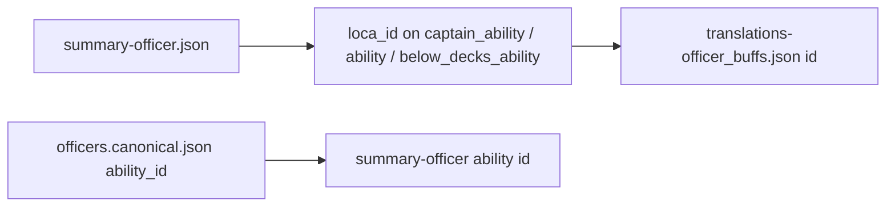

# Officer ability text: upstream translations vs LCARS

This document explains how **in-game ability names and descriptions** in the `data-stfc-space` translation dumps relate to **Kobayashi**’s `officers.lcars.yaml` and `officers.canonical.json`, and why names are not auto-hydrated today.

## Example: Ahvix

**Captain ability title** “Chirurgical Precision” **is** present in the translations bundle.

| Source | Role |
|--------|------|
| `data/upstream/data-stfc-space/translations-officer_buffs.json` | Rows with `key: "officer_ability_name"` (title only) and `key: "officer_ability_desc"` (full UI string with `<color=…>` markup). |
| `data/upstream/data-stfc-space/summary-officer.json` | Per-officer record; each of `captain_ability`, `ability` (bridge), `below_decks_ability` has numeric **`id`** (game ability id) and **`loca_id`** (localization row id). |

For officer **`id`: `229898163`** (Ahvix):

- **Captain** — `captain_ability.id` = `1074437376` (matches canonical `ability_id` `1.074437376E9`), **`captain_ability.loca_id` = `226`**.
- **Bridge** — `ability.id` = `3792739416` (matches canonical `3.792739416E9`), **`ability.loca_id` = `227`**.

In `translations-officer_buffs.json`, rows with **`id`: `226`** include:

- `officer_ability_name` → `Chirurgical Precision`
- `officer_ability_desc` → body text beginning with `<color=#309BBF>Chirurgical Precision</color>` and Ahvix’s Eclipse / first-three-rounds description.

Rows with **`id`: `227`** include **Shield Remodulation** (name + desc) for the bridge ability.

So: **ability titles and descriptions live in `translations-officer_buffs.json`**, keyed by the same **`id`** as **`loca_id`** on the corresponding ability in **`summary-officer.json`**.

## Mapping chain (mental model)

1. **`officers.canonical.json`** — `ability_id` strings are the game’s **ability** ids; they match **`captain_ability.id`**, **`ability.id`**, or **`below_decks_ability.id`** in **`summary-officer.json`** (compare as integers; canonical may use scientific notation).
2. **`summary-officer.json`** — **`loca_id`** on each ability points to **`translations-officer_buffs.json`** **`id`** for both **`officer_ability_name`** and **`officer_ability_desc`** rows (same numeric id, different `key`).

## Files that are *not* the ability title index

- **`translations-officers.json`** — Mostly **UI chrome** (fleet screen, tooltips, division names). Not per-ability titles.
- **`translations-officer_names.json`** — **Officer display names** (`officer_name`), not ability names.
- **`translations-officer_flavor_text.json`** — **Biography / flavor** by officer `id`, not abilities.

## `generate_lcars` and ability names

`cargo run --bin generate_lcars` **does** hydrate ability block names when the upstream files exist:

- Defaults: `data/upstream/data-stfc-space/summary-officer.json` and `translations-officer_buffs.json` (override with `--summary` / `--translations`).
- Join: canonical **`source_officer_id`** → summary officer **`id`**; each ability’s **`ability_id`** → summary **`captain_ability.id` / `ability.id` / `below_decks_ability.id`** → **`loca_id`** → translation row **`id`** with **`key`: `officer_ability_name`**.
- **`--no-ability-names`** skips loading and keeps placeholders `{Officer Name} (Captain|Bridge|Below Decks)`.

Hand-edited **`officers.lcars.yaml`** remains the project’s combat source of truth; regeneration overwrites those files when you run `generate_lcars` into that directory.

## Caveats

1. **Title collision** — The same **display title** can appear for **different** abilities (different `loca_id`). Example: **`Chirurgical Precision`** appears both for Ahvix’s Eclipse ability and for another officer’s kit with a **different** `officer_ability_desc`. Always key off **`loca_id`**, not the title string alone.
2. **Rich text** — Descriptions use Unity-style color tags; **`officer_ability_name`** rows are plain title text when present.
3. **Canonical descriptions** — `officers.canonical.json` **`description`** fields are human-curated summaries; they may align with **`officer_ability_desc`** but are not guaranteed to be generated from the same pipeline.

## Practical lookup (Ahvix)

1. Find officer in **`summary-officer.json`** by `id` **229898163** (or match **`source_officer_id`** / **`ability_id`** from canonical).
2. Read **`captain_ability.loca_id`** → **226**, **`ability.loca_id`** → **227**.
3. In **`translations-officer_buffs.json`**, filter entries with **`id`** **226** or **227** and **`key`** **`officer_ability_name`** or **`officer_ability_desc`**.

This is the intended mapping if you add tooling or docs to keep LCARS **`name:`** fields aligned with game strings.
